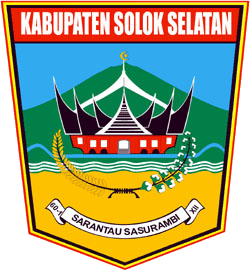

<!--
*** Thanks for checking out the Best Sulthanullah. If you have a suggestion
*** that would make this better, please fork the repo and create a pull request
*** or simply open an issue with the tag "enhancement".
*** Don't forget to give the project a star!
*** Thanks again! Now go create something AMAZING! :D
-->

<!-- PROJECT LOGO -->
 

  

  <h3 align="center">Sourcode Web Opd Solok Selatan</h3>

  

     
    <a href="https://www.facebook.com/profile.php?id=100006120976889">Report Bug</a>
    ·
    <a href="https://www.facebook.com/profile.php?id=100006120976889">Request Feature</a>
  

<!-- SCREENSHOT THEME VERSI 1 -->
## FIX MODUL
1. Modul HEADER
2. Modul FOOTER
3. Modul Nama Kepala Dinas
4. Modul Kata Sambutan
5. Modul Slider (Sudah tidak Gepeng)
6. Modul photo berita (Sudah tidak Gepeng)

## INFORMASI
Ini versi fix dalam tahun ini, install tetap sama dengan sebelumnya, dan struktur database tidak berubah.
Jika malas install lagi, cukup timpa sourcode sebelumnya
